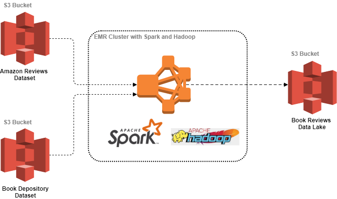
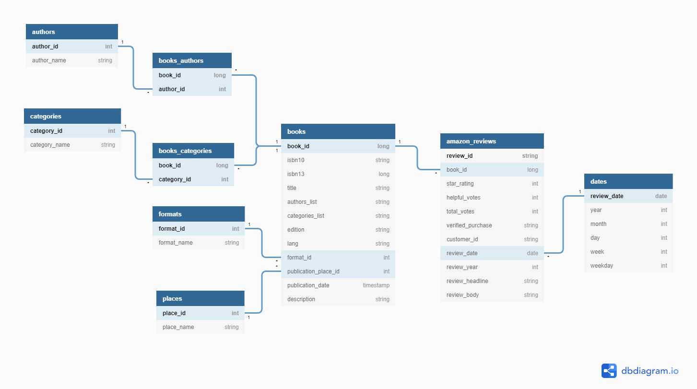
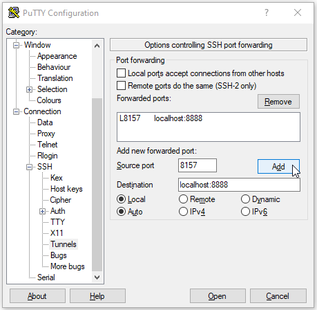
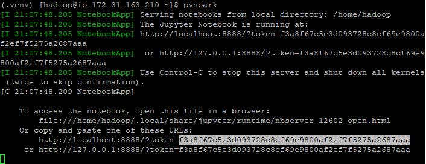
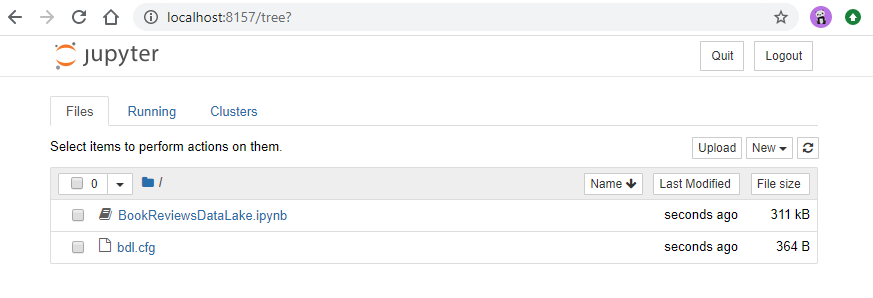

***
#### *Capstone Project for Udacity Data Engineering Nanodegree*
# Book Reviews Data Lake
***

## Introduction

This project goals to build a **Book Reviews Data Lake** containing data on books from across the world, along with Amazon reviews about them. For this purpose, we are going to use data sources provided by [Book Depository
](https://www.bookdepository.com/) and [Amazon](https://www.amazon.com/).

[Book Depository](https://www.bookdepository.com/) is a leading international book retailer that has a wide book catalog and delivers worldwide. We are going to use a dataset of books metadata scraped from their site and made available on [Kaggle](https://www.kaggle.com/datasets). More information about this dataset in the next section.

[Amazon](https://www.amazon.com/) has 20 years of online bookselling experience. Having always maintained high emphasis on customer satisfaction, the reliability of its Customer Reviews is one of the main strengths of the company. Amazon has a zero tolerance policy for any review designed to mislead or manipulate customers, and the company doesn't allow anyone to write reviews as a form of promotion. Therefore, the Product Reviews is one of Amazon’s iconic products. In a period of over two decades since the first review in 1995, millions of Amazon customers have contributed over a hundred million reviews to express opinions and describe their experiences regarding products on the Amazon.com website. 
 
The [Amazon Customer Reviews Dataset](https://registry.opendata.aws/amazon-reviews/) is maintained by Amazon itself, and contains product reviews in multiple languages and product categories, including books. However, it focus exclusively on the reviews, and does not contain specific books metadata, like authors, edition and others. 

This project joins data from both sources to produce a third one, aimed to provide data for analytical purposes. We are going to use [Spark](https://spark.apache.org/) to build a data processing pipeline that consumes raw books metadata and Amazon product reviews, joins both data sources through the books International Standard Book Number (ISBN), and writes the output to the Books Data Lake bucket in Amazon S3. 

## Data Sources

This project uses the following datasets:

### 1. Book Depository Dataset

This dataset is a large collection of books metadata, like title, description, authors, category and others. It was scraped from [Book Depository](https://www.bookdepository.com/), a leading international book retailer. 
 
 The following list describes each file in the dataset:
* `authors.csv` (**703,666 rows**): author names, matching the `authors` column from `dataset.csv`; a single book in the dataset may have more than one author.
* `categories.csv` (**2,767 rows**): category names, matching the `categories` column from `dataset.csv`; a single book in the dataset may have more than one category.
* `formats.csv` (**59 rows**): format names, matching the `format` column from `dataset.csv`.
* `places.csv` (**7,410 rows**): publication places (city and country), matching the `publication-place` column from `dataset.csv`.
* `dataset.csv` (**1,153,986 rows**): the actual dataset containing the catalog of books.

Source: https://www.kaggle.com/sp1thas/book-depository-dataset


### 2. Amazon Customer Reviews Dataset

This dataset is managed by [Amazon](https://www.amazon.com/) and contains over 130+ million customer reviews written from 1995 until 2015. For this project, we are interested only in the reviews for products of the category "Books". 

This dataset is available in two file formats: TSV (tab separated value) and Parquet. Since Parquet is more efficient and is already partitioned by `product_category`, which makes it more convenient to use since we will be reading data specific to the "Books" category, we will be using only the Parquet files where `product_category = Books` fot this project. 

Number of rows in the category "Books" of this dataset: **20,726,160**

Source: https://registry.opendata.aws/amazon-reviews/

## Use Cases

Some intended use cases for this Data Lake:
* Sentiment analysis on book reviews;
* Understanding how people rate usefulness of a review of a book, and what factors influence helpfulness of a review;
* Feeding data for a book recommender system.

## Architecture

This project builds an ETL pipeline for a data lake hosted on S3. This is done loading data from the source datasets, processing the data into analytics tables using Spark in an EMR cluster, and loading those tables back into S3. The notebook `BookReviewsDataLake.ipynb` includes the steps taken to build the data pipeline.

The choice to build a data lake in S3 instead of a data warehouse in Redshift is due mainly to reducing storage costs. Since this new dataset is being put together mainly for analytical purposes, there is no need for the cluster to be online 24/7. The analysis can be done by reading the data lake files.

As the datasets are too big to be wrangled locally by pandas, or even by Spark in standalone mode, it has been chosen to run the ETL pipeline in an EMR cluster containing both Spark and Hadoop applications. Also, since both datasets used by this project are static, the data pipeline was implemented in a Python Jupyter Notebook, in order to be run manually in a one-time execution.



## Data Model

After exploring the datasets, a Data Model was created as follows:



 Data dictionary: 

* Table: **AUTHORS** \
  Description: book authors
  
  | Column | Type | Description |
  | ------ | ---- | ----------- |
  | author_id | int | Author's unique ID |
  | author_name | string | Author's name |

* Table: **CATEGORIES** \
  Description: book categories

  | Column | Type | Description |
  | ------ | ---- | ----------- |
  | category_id | int | Category unique ID |
  | category_name | string | Category name |

* Table: **FORMATS** \
  Description: book formats

  | Column | Type | Description |
  | ------ | ---- | ----------- |
  | format_id | int | Format unique ID |
  | format_name | string | Format name |

* Table: **PLACES** \
  Description: book publication places

  | Column | Type | Description |
  | ------ | ---- | ----------- |
  | place_id | int | Publication place unique ID |
  | place_name | string | Publication place (city, country) |

* Table: **BOOKS** \
  Description: books

  | Column | Type | Description |
  | ------ | ---- | ----------- |
  | book_id | long | Book's unique ID |
  | isbn10 | string | Book's ISBN-10 |
  | isbn13 | long | Book's ISBN-13 |
  | title | string | Book's title |
  | authors_list | string | List of the book's authors IDs, in the format [##, ##, ##, ...] |
  | categories_list | string | List of the book's categories IDs, in the format [##, ##, ##, ...] |
  | edition | string | Book edition |
  | lang | string | Abbreviation of the book's language (e.g. "en" for English) |
  | format_id | int | ID of the book's format |
  | publication_place_id | int | ID of the book's publication place |
  | publication_date | timestamp | Publication date |
  | description | string | Book description |

* Table: **BOOKS_AUTHORS** \
  Description: many-to-many relationship between books and authors

  | Column | Type | Description |
  | ------ | ---- | ----------- |
  | book_id | long | Book ID |
  | author_id | int | Author ID |

* Table: **BOOKS_CATEGORIES** \
  Description: many-to-many relationship between books and categories

  | Column | Type | Description |
  | ------ | ---- | ----------- |
  | book_id | long | Book ID |
  | category_id | int | Category ID |


* Table: **AMAZON_REVIEWS** \
  Description: customer reviews for books on Amazon

  | Column | Type | Description |
  | ------ | ---- | ----------- |
  | review_id | string | Review unique ID |
  | book_id | long | Book ID |
  | star_rating | int | The 1-5 star rating of the review |
  | helpful_votes | int | Number of helpful votes the review received |
  | total_votes | int | Number of total votes the review received |
  | verified_purchase | string | Identifies if the review is on a verified purchase (Y or N) |
  | customer_id | string | Customer ID in Amazon; can be used to aggregate reviews written by a single author |
  | review_date | date | Date when the review was written |
  | review_year | int | Year when the review was written |
  | review_headline | string | Title of the review |
  | review_body | string | Review text |

* Table: **DATES** \
  Description: metadata on review dates

  | Column | Type | Description |
  | ------ | ---- | ----------- |
  | review_date | date | Review date (yyyy-MM-dd) |
  | year | int | Year |
  | month | int | Month (numeric) |
  | day | int | Day of the month (numeric) |
  | week | int | Week number of the year (numeric) |
  | weekday | int | Day of the week (numeric) |


## Running the Data Pipeline

In order to run the notebook `BookReviewsDataLake.ipynb` on an EMR cluster, follow these steps:

* Create an EMR cluster containing Spark and Hadoop applications. You can use the AWS Guide available [here](https://docs.aws.amazon.com/emr/latest/ManagementGuide/emr-gs.html). To test this project, it was used a 4-node cluster with `m5.xlarge` instance types.

* Connect to the Master Node of the EMR cluster using SSH (instructions in [this AWS Guide](https://docs.aws.amazon.com/emr/latest/ManagementGuide/emr-connect-master-node-ssh.html)). Also, in order to run the notebook set up an SSH tunnel on local port 8157 to port 8888 on the master node, using local port forwarding. 

  On Linux, Unix, and Mac OS X, this can be achieved through the following options:
  
  ```
  ssh -i ~/mykeypair.pem -N -L 8157:localhost:8888 hadoop@ec2-###-##-##-###.compute-1.amazonaws.com
  ```
  
  On Windows, you can use PuTTY to configure the port forwarding:
  
  

* In the EMR command line:

  * Create a Python 3 virtual environment and activate it:

    ```
    python3 -m venv .venv
    source .venv/bin/activate
    ```

  * Run the commands below to install the Python packages on the virtual environment:

    ```
    pip install jupyter
    pip install pandas
    ```

  * Run the following commands to set up the environment variables:

    ```
    export PYSPARK_PYTHON=python3
    export PYSPARK_DRIVER_PYTHON=jupyter
    export PYSPARK_DRIVER_PYTHON_OPTS='notebook --no-browser --port=8888'
    ```
 
  * Run `pyspark`:

    ```
    pyspark
    ```

  * Copy the token, as highlighted in the example below:
    
    
  
* On the web browser, type the address `http://localhost:8157`. Paste the token from last step and log in.

* In Jupyter Notebook, upload the following files from the project:
   * `BookReviewsDataLake.ipynb`
   * `bdl.cfg`

    

* Open the configuration file `btl.cfg` and set your AWS credentials (`AWS_ACCESS_KEY_ID` and `AWS_SECRET_ACCESS_KEY`) and the `OUTPUT_DATA` parameter with the path of the S3 Bucket where the Data Lake will be hosted.

* Open the notebook `BookReviewsDataLake.ipynb` and follow the instructions to run the ETL pipeline in there.

## Other Scenarios

* In a scenario where the data was increased by 100x, it would be recommended to configure an EMR cluster with more nodes, or choose instance types with higher processing capacity for each node.

* In a real case in which new data would become available in a daily basis, I would orchestrate the workflow setting up a DAG in [Apache AirFlow](https://airflow.apache.org/) splitting the logic included in the notebook `BookReviewsDataLake.ipynb` in Python operators and scheduling the DAG to run once a day.

* If the database had to be accessed by 100+ people, I would load the data into Amazon Redshift, since it is an analytical database optimized for aggregation and read-heavy workloads, and has auto-scaling capabilities.